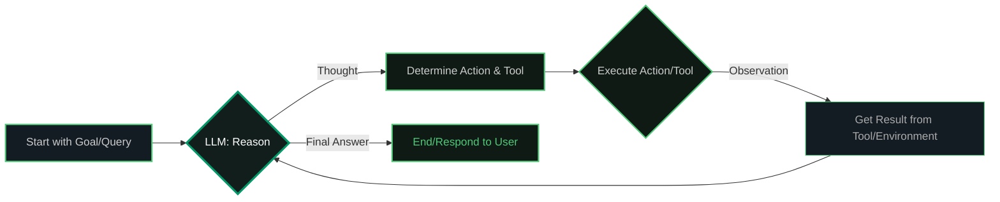

# Project: VoltAgent

**Date Created:** 2025-05-24  
**Version:** 1.0  
**Lead Developer:** @ssdeanx  
**Repo:** _private local, see workspace structure_  
**Status:** Active Development (Core features implemented, extensible)

---

## Overview

VoltAgent is an open-source TypeScript framework for building, orchestrating, and scaling AI agents. It is designed for modularity, extensibility, and robust multi-agent workflows, with a focus on developer productivity and advanced memory management.

## Architecture & Tech Stack

- **Language:** TypeScript (Node.js)
- **Core Framework:** [@voltagent/core](https://voltagent.dev)
- **LLM Provider:** Google Gemini (via @voltagent/google-ai)
- **Memory:** Thread-aware, persistent memory using LibSQL/Turso (with custom ConversationMemory for VoltAgent compatibility)
- **Vector Search:** Integrated vector memory for semantic search (vectorMemory)
- **Database:** LibSQL (local SQLite for dev, Turso for prod)
- **Tooling:** Modular tool system (browser automation, web, file, delegation, etc.)
- **State Management:** All agent state is thread- and user-scoped
- **Package Management:** npm (project standard)

## Project Architecture & Flow

### System Flow Overview



The VoltAgent system follows a hierarchical multi-agent architecture:

1. **Entry Point**: `src/index.ts` - Initializes the entire system
2. **Supervisor Agent**: Central orchestrator that analyzes requests and delegates to specialists
3. **Specialized SubAgents**: Domain-specific agents with their own tools and expertise
4. **Memory Layer**: Thread-aware, persistent memory shared across all agents
5. **Tool Layer**: Modular tools for external integrations (web, files, git, browser automation)
6. **MCP Layer**: Model Context Protocol for external tool integrations

### Core Components

#### 1. Main Entry Point (`src/index.ts`)

- Initializes all agents and registers them in the agent registry
- Sets up the supervisor agent with delegation capabilities
- Configures global memory, MCP tools, and system-wide hooks
- Establishes the VoltAgent server with telemetry and observability

#### 2. Supervisor Agent

- **Role**: Central coordinator and task router
- **Model**: Google Gemini 2.5 Flash Preview (advanced reasoning)
- **Capabilities**:
  - Request analysis and agent selection
  - Multi-agent workflow coordination
  - Filesystem operations via MCP
  - Memory management and context synthesis
- **Tools**: MCP filesystem tools + delegation tool
- **Decision Logic**: Analyzes incoming requests to determine optimal agent(s) for the task

#### 3. Specialized SubAgents

##### Data Analyst Agent (`src/agents/dataAnalysisAgent.ts`)

- **Purpose**: Statistical analysis, data processing, trend analysis
- **Tools**: Data formatter, text analyzer, web search, URL fetch
- **Specializations**: CSV/JSON analysis, statistical modeling, visualization recommendations

##### Content Creator Agent (`src/agents/contentCreationAgent.ts`)

- **Purpose**: Writing, editing, content strategy, research
- **Tools**: Text analyzer, data formatter, web search, URL fetch
- **Specializations**: Blog posts, documentation, marketing copy, SEO optimization

##### File Manager Agent (`src/agents/fileManagerAgent.ts`)

- **Purpose**: Version control, repository management, file operations
- **Tools**: Git operations, GitHub API, filesystem access
- **Specializations**: Repository analysis, branch management, code review, file organization

##### Developer Agent (`src/agents/developerAgent.ts`)

- **Purpose**: Software development, code analysis, technical solutions
- **Tools**: GitHub API, Git operations, web search, URL fetch
- **Specializations**: Code review, architecture analysis, dependency tracking, best practices

##### System Admin Agent (`src/agents/systemAdminAgent.ts`)

- **Purpose**: System monitoring, configuration, troubleshooting
- **Tools**: System info, web search for advisories
- **Specializations**: Performance monitoring, security assessment, diagnostics

##### Problem Solver Agent (`src/agents/problemSolvingAgent.ts`)

- **Purpose**: Complex problem solving, multi-step reasoning
- **Tools**: Web search, system info, research capabilities
- **Specializations**: Root cause analysis, solution design, troubleshooting workflows

##### Browser Agent (`src/agents/browserAgent.ts`)

- **Purpose**: Web automation, scraping, UI testing
- **Tools**: Playwright-based navigation, interaction, screenshots
- **Specializations**: Website testing, data extraction, automation workflows

#### 4. Memory Architecture (`src/memory/`)

##### Global Memory (`globalMemory`)

- **Type**: ConversationMemory (VoltAgent-compatible)
- **Storage**: LibSQL (SQLite for dev, Turso for prod)
- **Features**: Thread-aware, user-scoped, persistent across sessions
- **Capabilities**: History tracking, event logging, step recording

##### Vector Memory (`vectorMemory`)

- **Purpose**: Semantic search and context retrieval
- **Technology**: Embeddings-based similarity search
- **Use Case**: Contextual information retrieval across conversations

##### Specialized Retrievers

- **Supervisor Retriever**: Context retrieval for coordination decisions
- **Code Retriever**: Technical context for development tasks

#### 5. Tool Ecosystem (`src/tools/`)

##### Core Tools

- **Delegation Tool**: Multi-agent task coordination
- **Web Tools**: Search, URL fetching, content analysis
- **Git Tools**: Repository operations, version control
- **GitHub Tools**: API integration, repository management

##### Browser Automation Tools

- **Navigation**: URL navigation, page management
- **Interaction**: Click, type, form submission
- **Data Extraction**: Screenshots, visible text, element discovery
- **Playwright Handler**: Browser lifecycle management

##### MCP Integration (`src/tools/mcp.ts`)

- **Filesystem Server**: File operations via Model Context Protocol
- **Extensible**: Ready for additional MCP servers (git, databases, etc.)

#### 6. Agent Hooks & Observability (`src/agents/agentHooks.ts`)

- **Development Hooks**: Comprehensive logging and tracing
- **Performance Monitoring**: Token usage, execution time, error tracking
- **Cross-Agent Communication**: Handoff tracking, delegation logging
- **Memory Events**: Operation recording for audit trails

### Execution Flow Examples

#### Simple Request Flow

```bash
User: "Analyze this CSV data"
↓
SupervisorAgent: Analyzes request → Determines dataAnalyst is optimal
↓
Delegation: delegate_task("analyze CSV", ["dataAnalyst"])
↓
DataAnalyst: Processes data using text analyzer and data formatter tools
↓
Result: Statistical analysis with insights and recommendations
```

#### Complex Multi-Agent Flow

```bash
User: "Create a blog post about the latest JavaScript framework trends"
↓
SupervisorAgent: Identifies need for research + content creation
↓
Delegation: delegate_task("research JS trends", ["developer", "contentCreator"])
↓
Developer: Researches technical aspects, analyzes GitHub repos
ContentCreator: Researches writing trends, analyzes audience preferences
↓
SupervisorAgent: Synthesizes research into comprehensive blog post
↓
Result: Well-researched, technically accurate, audience-optimized content
```

#### Browser Automation Flow

```bash
User: "Test the login form on example.com"
↓
SupervisorAgent: Determines browser automation needed
↓
BrowserAgent: 
  1. Navigate to example.com
  2. Take screenshot of initial state
  3. Locate login form elements
  4. Test form interactions
  5. Capture results and errors
↓
Result: Detailed test report with screenshots and recommendations
```

## Key Features

### Multi-Agent Coordination

- **Supervisor Pattern**: Central orchestration with specialized delegation
- **Dynamic Agent Selection**: Intelligent routing based on request analysis
- **Parallel Execution**: Multiple agents can work simultaneously on complex tasks
- **Result Synthesis**: Coherent combination of multi-agent outputs

### Memory & Context Management

- **Thread-Aware Memory**: Each conversation maintains its own context
- **Cross-Agent Memory**: Shared context between agent interactions
- **Persistent Storage**: LibSQL/Turso for reliable data persistence
- **Vector Search**: Semantic retrieval of relevant historical context

### Browser Automation

- **Playwright Integration**: Full browser automation capabilities
- **Visual Testing**: Screenshot capture and comparison
- **Dynamic Interaction**: Form filling, clicking, navigation
- **Data Extraction**: Intelligent text and element extraction

### Developer Tools

- **Git Integration**: Full version control operations
- **GitHub API**: Repository management and analysis
- **Code Analysis**: Quality assessment and review capabilities
- **Project Scaffolding**: Template and structure management

### Observability & Monitoring

- **Comprehensive Logging**: All operations tracked with context
- **Performance Metrics**: Token usage, execution time, error rates
- **Tracing**: Request flow through the multi-agent system
- **Memory Analytics**: Conversation and context usage patterns

### Security & Validation

- **Zod Schemas**: Type-safe validation for all data boundaries
- **Input Sanitization**: Protection against injection attacks
- **Environment Variables**: Secure configuration management
- **Least Privilege**: Minimal required permissions for operations

## Development Status

### Completed Implementation

- ✅ All 7 specialized agents implemented and tested
- ✅ Supervisor agent with intelligent delegation
- ✅ Thread-aware global memory system
- ✅ Browser automation with Playwright
- ✅ MCP filesystem integration
- ✅ Comprehensive tool ecosystem
- ✅ Cross-cutting concerns (logging, tracing, validation)
- ✅ Agent hooks and observability

### Production Ready Features

- ✅ Robust error handling and recovery
- ✅ Scalable memory architecture
- ✅ Security best practices implementation
- ✅ Comprehensive documentation and examples
- ✅ Type-safe APIs with Zod validation

### Current Capabilities

- Multi-agent workflows for complex tasks
- Browser automation and web testing
- Code analysis and repository management
- Content creation and research
- System monitoring and administration
- Data analysis and visualization
- Problem solving and troubleshooting

## How to Use

### Quick Start

```bash
# Install dependencies
npm install

# Set up environment variables
cp .env.example .env
# Add your GOOGLE_GENERATIVE_AI_API_KEY

# Start the development server
npm run dev
```

### Basic Usage Examples

#### Single Agent Interaction

```typescript
import { dataAnalysisAgent } from './src/agents/dataAnalysisAgent';

const result = await dataAnalysisAgent.generateText(
  'Analyze the trends in this sales data: [CSV data]',
  { userId: 'user123', conversationId: 'conv456' }
);
```

#### Supervisor Delegation

```typescript
import { supervisorAgent } from './src/index';

const result = await supervisorAgent.generateText(
  'Create a comprehensive analysis of our Q4 performance and generate a presentation',
  { userId: 'user123', conversationId: 'conv456' }
);
// Supervisor will delegate to dataAnalyst and contentCreator
```

#### Browser Automation TT

```typescript
import { browserAgent } from './src/agents/browserAgent';

const result = await browserAgent.generateText(
  'Go to https://example.com and extract all product prices',
  { userId: 'user123', conversationId: 'conv456' }
);
```

### Development Guidelines

- **Package Management**: Use npm for all dependency operations
- **Agent Creation**: Follow patterns in `src/agents/` for new agents
- **Tool Development**: Implement tools in `src/tools/` with proper schemas
- **Memory Usage**: Leverage globalMemory for persistent context
- **Error Handling**: Use try/catch with proper logging
- **Validation**: Define Zod schemas for all data boundaries

### Extension Points

- **New Agents**: Add specialized agents for domain-specific tasks
- **Custom Tools**: Integrate external APIs and services
- **Memory Processors**: Add custom memory processing logic
- **MCP Servers**: Integrate additional external tool providers
- **Observability**: Extend telemetry and monitoring capabilities

## References

- [README.md](./README.md)
- [CHANGELOG.md](./CHANGELOG.md)
- [src/agents/](./src/agents/)
- [src/memory/index.ts](./src/memory/index.ts)
- [src/tools/](./src/tools/)

---

_Last updated: 2025-05-29_
