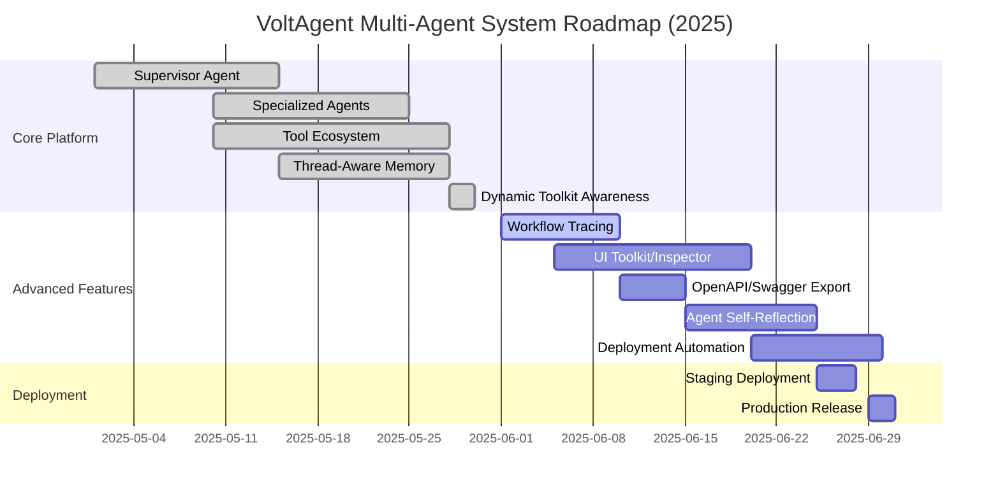
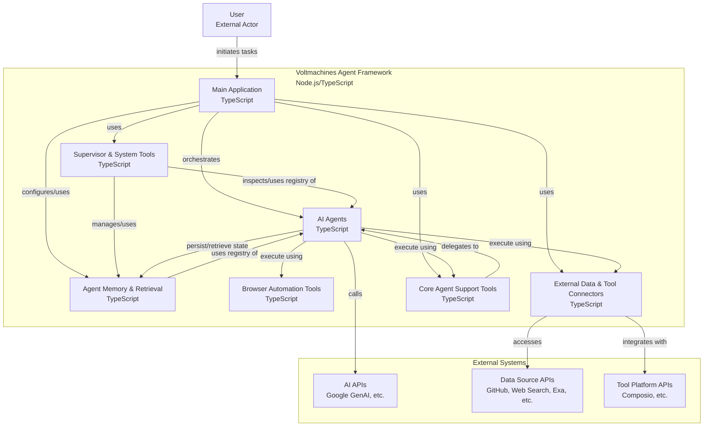

[](https://voltagent.dev/)
<br/>
<br/>

<div align="center">
    <a href="https://voltagent.dev">Home Page</a> |
    <a href="https://voltagent.dev/docs/">Documentation</a> |
    <a href="https://github.com/voltagent/voltagent/tree/main/examples">Examples</a> |
    <a href="https://s.voltagent.dev/discord">Discord</a> |
    <a href="https://voltagent.dev/blog/">Blog</a>
</div>
</div>

<br/>

<div align="center">
    <strong>VoltAgent is an open source TypeScript framework for building and orchestrating AI agents.</strong><br>
Escape the limitations of no-code builders and the complexity of starting from scratch.
    <br />
    <br />
</div>

<div align="center">

[](https://www.npmjs.com/package/@voltagent/core)
[](CODE_OF_CONDUCT.md)
[](https://s.voltagent.dev/discord)
[](https://twitter.com/voltagent_dev)

</div>

<br/>

<div align="center">
<a href="https://voltagent.dev/">

</a>

</div>

[](https://nodejs.org/)
[](https://www.typescriptlang.org/)
[](https://zod.dev/)
[](https://ai.google.dev/)
[](https://playwright.dev/)
[](https://turso.tech/)
[](LICENSE)

# VoltAgent Multi-Agent System

**A production-ready TypeScript framework for building intelligent, orchestrated AI agent ecosystems.**

VoltAgent is an advanced open-source framework that enables developers to create sophisticated multi-agent AI systems with ease. Our implementation showcases a complete ecosystem of specialized agents working in harmony, featuring advanced reasoning capabilities, persistent memory, and comprehensive tool integration.

---

## 🚀 System Overview

- **🧠 Supervisor Agent:** Central orchestrator with advanced delegation and workflow management.
- **🔬 10 Specialized Agents:** Domain experts for data analysis, development, content creation, and more.
- **💾 Thread-Aware Memory:** Persistent, context-aware memory across all conversations.
- **🛠️ Rich Tool Ecosystem:** 25+ tools including browser automation, Git operations, and MCP integration.
- **📊 Structured Generation:** Zod-validated schemas for reliable, type-safe outputs.

---

## ✨ Key Features

### 🏗️ Architecture

- **VoltAgent Core:** Enterprise-grade TypeScript framework with full type safety.
- **Google Gemini Integration:** Primary LLM provider with advanced reasoning capabilities.
- **Memory Architecture:** Thread-aware, persistent memory with vector search capabilities.
- **Tool Composition:** Modular tool system with dynamic composition and validation.

### 🤖 Agent Ecosystem

- **Supervisor Agent:** Intelligent delegation and multi-agent workflow orchestration.
- **Specialized Agents:** Browser, Developer, Data Analysis, Content Creation, Research, System Admin, File Manager, Documentation, and more.
- **Unified Prompt & Capabilities:** All agents use a dynamic, capability-driven prompt and config schema.

### 🧩 Dynamic Toolkit Awareness

- **Auto-Synced Capabilities:** The supervisor agent's capabilities are always generated from the real toolset—no manual config needed.
- **Context & Memory Integration:** The toolkit is always available in the agent's config, LLM prompt/context, and memory options for all subagents and consumers.
- **Zero Drift:** Add or remove tools and the system instantly reflects the change everywhere (config, prompt, memory, UI).

#### Usage Example

```typescript
const toolkit = supervisorAgent.memoryOptions.toolkitCapabilities;
// or, from config:
const toolkit = supervisorConfig.capabilities;
```

This ensures your UI, subagents, and orchestration logic are always in sync with the real tools available.

### 🔄 Multi-Agent Workflows

- **Intelligent Delegation:** Context-aware agent selection and task routing.
- **Parallel Processing:** Concurrent agent execution for complex workflows.
- **Memory Sharing:** Cross-agent context and knowledge persistence.
- **Error Recovery:** Robust error handling and workflow continuation.

---

## 🧰 Technology Stack

- **Node.js 18+**: Runtime environment
- **TypeScript 5.x**: Type safety and modern development
- **Zod**: Schema validation and type-safe outputs
- **Google Gemini**: Advanced LLM for reasoning and generation
- **Playwright**: Browser automation and web scraping
- **LibSQL/Turso**: Distributed, persistent memory storage
- **VoltAgent Core**: Multi-agent orchestration framework

## 🖥️ VoltAgent Console: Real-Time Agent Visualization & Debugging


> **Visualize, debug, and understand your AI agent workflows in real-time with the VoltAgent Console.**

The **VoltAgent Console** is a modern, web-based UI for observing, debugging, and optimizing your multi-agent system. It provides a live, interactive visualization of agent workflows, tool usage, and memory—making it easy to develop, test, and operate complex AI systems with confidence.

### 🌟 Key Features

- **Real-Time Visualization:**
  Instantly see your agents' execution graphs, including all function calls, tool invocations, and message flows as they happen.
- **Step-by-Step Debugging:**
  Inspect every step in the agent's reasoning, including LLM prompts, tool inputs/outputs, and memory state.
- **Timeline & Trace:**
  View a chronological timeline of all agent actions, with the ability to drill down into any event for full context.
- **Multi-Agent Awareness:**
  See how the supervisor and all subagents interact, delegate, and collaborate on tasks.
- **Secure Local Debugging:**
  All data remains on your machine during local development—no cloud upload unless you enable production telemetry.
- **Production Telemetry (Optional):**
  With [VoltAgentExporter](https://voltagent.dev/docs/observability/developer-console/#production-tracing-with-voltagentexporter), send traces and logs to the VoltAgent cloud for persistent monitoring, audit, and analytics.

### 🚀 Getting Started

1. **Enable Observability:**
   Ensure your VoltAgent app is started with observability enabled (default in this repo). You'll see output like:

   ```bash
   VOLTAGENT SERVER STARTED SUCCESSFULLY
   ✓ HTTP Server: http://localhost:3141
   Developer Console: https://console.voltagent.dev
   ```

2. **Open the Console:**
   Go to [https://console.voltagent.dev/](https://console.voltagent.dev/) in your browser.
3. **Connect to Localhost:**
   The console will auto-connect to your local agent server (`http://localhost:3141`). You can change the URL in settings if needed.
4. **Sign In (Optional):**
   Use GitHub or Google to sign in for cloud features, or use local mode for private debugging.

### 🧑‍💻 UI Walkthrough

- **Login Screen:**
  Authenticate with GitHub or Google for cloud projects, or continue in local mode.
- **Agent List View:**
  See all active and recent agent sessions.
- **Execution Graph:**
  Visual, node-based flow of agent actions, tool calls, and subagent delegations.
- **Timeline Panel:**
  Chronological list of all events, with status indicators and filtering.
- **Step Inspector:**
  Click any node or event to see full details: prompts, tool parameters, outputs, logs, and memory snapshots.
- **Connection Status:**
  Live feedback on your connection to the local agent server.

### 🔒 Data Privacy

- **Local Debugging:**
  All execution data stays on your machine when using the console with `localhost`.
- **Production Telemetry:**
  To enable persistent, cloud-based monitoring, configure the `VoltAgentExporter` with your project keys. See [Production Tracing with VoltAgentExporter](https://voltagent.dev/docs/observability/developer-console/#production-tracing-with-voltagentexporter).

### 📈 Why Use the Console?

- **Accelerate Development:**
  Instantly see what your agents are doing, catch bugs, and optimize workflows.
- **Enterprise Observability:**
  Monitor, audit, and analyze agent behavior in production with full traceability.
- **Collaboration:**
  Share traces and debug sessions with your team for faster troubleshooting.

### 📚 Learn More

- [VoltAgent Console Documentation](https://voltagent.dev/docs/observability/developer-console/)
- [Production Tracing & Telemetry](https://voltagent.dev/docs/observability/developer-console/#production-tracing-with-voltagentexporter)

---

## 🚦 Future Scope & Roadmap

### Gantt-Style Timeline (2025)



#### **Planned Features**

- **Workflow Tracing:** Visualize and debug multi-agent workflows.
- **UI Toolkit/Inspector:** Web UI for agent/tool inspection and orchestration.
- **OpenAPI/Swagger Export:** Auto-generate API docs from Zod schemas.
- **Agent Self-Reflection:** Agents can reason about their own capabilities and history.
- **Deployment Automation:** CI/CD for seamless updates and scaling.
- **Staging & Production Releases:** Robust deployment pipeline.

---

## 🚀 Quick Start

### Prerequisites

```bash
# Node.js 18+ required
node --version

# Install dependencies with npm
npm install
```

### Basic Usage

```typescript
import { supervisorAgent } from './src/index.js';

const result = await supervisorAgent.generateText(
  "Analyze the React codebase in this repository and suggest improvements",
  { userId: 'user-123', conversationId: 'analysis-session' }
);

console.log(result.text);
```

---

## 📈 Performance & Scalability

- **Concurrent Processing:** Multi-agent parallel execution.
- **Memory Optimization:** Efficient vector search and context retrieval.
- **Type Safety:** Full TypeScript compliance with Zod validation.
- **Error Resilience:** Comprehensive error handling and recovery.
- **Monitoring:** Built-in telemetry and performance tracking.

---

## 🔧 Configuration

### Environment Variables

```bash
GOOGLE_GENERATIVE_AI_API_KEY=your_gemini_api_key
DATABASE_URL=your_database_url
VOLTAGENT_PUBLIC_KEY=your_voltagent_public_key
VOLTAGENT_SECRET_KEY=your_voltagent_secret_key
```

### Database Setup

The system uses LibSQL/Turso for persistent memory storage.

---

## 🚀 Deployment

- **Staging:** Deploy to a staging environment for integration and QA.
- **Production:** Use CI/CD to deploy to production. Ensure all environment variables and database connections are set.
- **Monitoring:** Use built-in telemetry and logs for health and performance.
- **Scaling:** Horizontally scale agents and memory as needed for workload.

---

## 📦 Project Structure Graph



---

## 🤝 Contributing

We welcome contributions! See [TASKS.md](./TASKS.md) for areas where you can help.

---

## 📚 Documentation

- **[Project Overview](./PROJECT.md):** Detailed architecture and technical specifications.
- **[Development Tasks](./TASKS.md):** Roadmap and contribution opportunities.
- **[Changelog](./CHANGELOG.md):** Version history and recent improvements.
- **[VoltAgent Docs](https://voltagent.dev/docs/):** Official framework documentation.

---

## 🙏 Acknowledgments

Built with:

- [VoltAgent](https://voltagent.dev/)
- [Google Gemini](https://ai.google.dev/)
- [Playwright](https://playwright.dev/)
- [Zod](https://zod.dev/)
- [LibSQL/Turso](https://turso.tech/)

---

Ready to build intelligent agent systems?
[Get Started](https://voltagent.dev/docs/) • [Join Discord](https://s.voltagent.dev/discord) • [VoltAgent Core](https://github.com/voltagent/voltagent)

---
