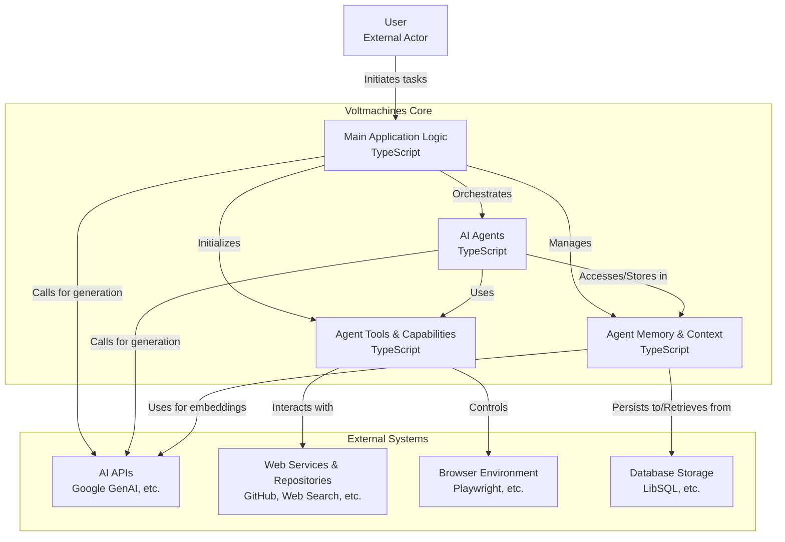

[](https://voltagent.dev/)
<br/>
<br/>

<div align="center">
    <a href="https://voltagent.dev">Home Page</a> |
    <a href="https://voltagent.dev/docs/">Documentation</a> |
    <a href="https://github.com/voltagent/voltagent/tree/main/examples">Examples</a> |
    <a href="https://s.voltagent.dev/discord">Discord</a> |
    <a href="https://voltagent.dev/blog/">Blog</a>
</div>
</div>

<br/>

<div align="center">
    <strong>VoltAgent is an open source TypeScript framework for building and orchestrating AI agents.</strong><br>
Escape the limitations of no-code builders and the complexity of starting from scratch.
    <br />
    <br />
</div>

<div align="center">

[](https://www.npmjs.com/package/@voltagent/core)
[](CODE_OF_CONDUCT.md)
[](https://s.voltagent.dev/discord)
[](https://twitter.com/voltagent_dev)

</div>

<br/>

<div align="center">
<a href="https://voltagent.dev/">

</a>

</div>

## VoltAgent Multi-Agent System

**A production-ready TypeScript framework for building intelligent, orchestrated AI agent ecosystems.**

VoltAgent is an advanced open-source framework that enables developers to create sophisticated multi-agent AI systems with ease. Our implementation showcases a complete ecosystem of specialized agents working in harmony, featuring advanced reasoning capabilities, persistent memory, and comprehensive tool integration.

## 🎯 **System Overview**

This project demonstrates a **hierarchical multi-agent architecture** built on VoltAgent Core, featuring:

- **🧠 Supervisor Agent**: Central orchestrator with advanced delegation and workflow management
- **🔬 9 Specialized Agents**: Domain experts for data analysis, development, content creation, and more
- **💾 Thread-Aware Memory**: Persistent, context-aware memory across all conversations
- **🛠️ Rich Tool Ecosystem**: 25+ tools including browser automation, Git operations, and MCP integration
- **📊 Structured Generation**: Zod-validated schemas for reliable, type-safe outputs

## ✨ **Key Features**

### 🏗️ **Architecture**

- **VoltAgent Core**: Enterprise-grade TypeScript framework with full type safety
- **Google Gemini Integration**: Primary LLM provider with advanced reasoning capabilities
- **Memory Architecture**: Thread-aware, persistent memory with vector search capabilities
- **Tool Composition**: Modular tool system with dynamic composition and validation

### 🤖 **Agent Ecosystem**

- **Supervisor Agent**: Intelligent delegation and multi-agent workflow orchestration
- **Browser Agent**: Advanced Playwright automation with visual analysis
- **Developer Agent**: Code analysis, repository management, and development workflows
- **Data Analysis Agent**: Statistical analysis, visualization, and data processing
- **Content Creation Agent**: Writing, SEO optimization, and content strategy
- **Research Agent**: Information gathering, synthesis, and citation management
- **System Admin Agent**: Infrastructure monitoring and system optimization
- **File Manager Agent**: Git operations, repository analysis, and file management
- **Documentation Agent**: Technical writing and documentation generation

### 🛠️ **Advanced Tooling**

- **Browser Automation**: Playwright-powered web interaction and scraping
- **Git Integration**: Complete version control workflow management
- **MCP Protocol**: Model Context Protocol for external tool integration
- **Vector Memory**: Semantic search and context retrieval
- **Structured Output**: Zod-validated schemas for reliable data generation

### 🔄 **Multi-Agent Workflows**

- **Intelligent Delegation**: Context-aware agent selection and task routing
- **Parallel Processing**: Concurrent agent execution for complex workflows
- **Memory Sharing**: Cross-agent context and knowledge persistence
- **Error Recovery**: Robust error handling and workflow continuation

## 🚀 **Quick Start**

### Prerequisites

```bash
# Node.js 18+ required
node --version

# Install dependencies with npm
npm install
```

### Basic Usage

```typescript
import { supervisorAgent } from './src/index.js';

// Simple agent interaction
const result = await supervisorAgent.generateText(
  "Analyze the React codebase in this repository and suggest improvements",
  { userId: 'user-123', conversationId: 'analysis-session' }
);

console.log(result.text);
```

### Multi-Agent Workflow

```typescript
import { agentRegistry } from './src/agents/index.js';

// Complex workflow with multiple agents
const workflow = async () => {
  // 1. Browser agent scrapes competitor data
  const browserResult = await agentRegistry.browser.generateText(
    "Visit competitor.com and analyze their pricing strategy"
  );
  
  // 2. Data analysis agent processes the information
  const analysisResult = await agentRegistry.dataAnalyst.generateText(
    `Analyze this competitive data: ${browserResult.text}`
  );
  
  // 3. Content agent creates strategy document
  const contentResult = await agentRegistry.contentCreator.generateText(
    `Create a competitive analysis report based on: ${analysisResult.text}`
  );
  
  return contentResult.text;
};
```

## 📊 **Structured Generation**

Generate type-safe, validated outputs using Zod schemas:

```typescript
import { z } from 'zod';

const analysisSchema = z.object({
  findings: z.array(z.object({
    category: z.enum(['performance', 'security', 'maintainability']),
    severity: z.enum(['low', 'medium', 'high', 'critical']),
    description: z.string(),
    recommendation: z.string()
  })),
  summary: z.string(),
  confidence: z.number().min(0).max(1)
});

const result = await dataAnalysisAgent.generateObject({
  schema: analysisSchema,
  prompt: "Analyze this codebase for issues and improvements"
});

// Fully typed result with validation
console.log(result.object.findings);
```

## 🛠️ **Development & Testing**

### Project Structure

```
src/
├── index.ts              # Main entry point and supervisor agent
├── agents/               # Specialized agent implementations
│   ├── browserAgent.ts   # Web automation and scraping
│   ├── developerAgent.ts # Code analysis and development
│   ├── dataAnalysisAgent.ts # Statistical analysis and visualization
│   └── ...              # Additional specialized agents
├── memory/               # Memory and retrieval systems
│   ├── index.ts         # Core memory implementation
│   ├── vectorMemory.ts  # Vector search capabilities
│   └── *Retriever.ts    # Agent-specific retrievers
├── tools/                # Tool ecosystem
│   ├── baseTools.ts     # Core tool implementations
│   ├── browserBaseTools.ts # Browser automation tools
│   ├── toolkit.ts       # Tool composition framework
│   └── mcp.ts          # Model Context Protocol integration
└── config/              # Configuration and database setup
```

### Running the System

```bash
# Install dependencies
npm install

# Start the development server
npm dev

# Run type checking
npm type-check

# Run linting
npm lint
```

### Building for Production

```bash
# Build the project
npm build

# Run the built version
npm start
```

## 📈 **Performance & Scalability**

- **Concurrent Processing**: Multi-agent parallel execution
- **Memory Optimization**: Efficient vector search and context retrieval
- **Type Safety**: Full TypeScript compliance with Zod validation
- **Error Resilience**: Comprehensive error handling and recovery
- **Monitoring**: Built-in telemetry and performance tracking

## 🔧 **Configuration**

### Environment Variables

```bash
# Required
GOOGLE_GENERATIVE_AI_API_KEY=your_gemini_api_key

# Optional
DATABASE_URL=your_database_url
VOLTAGENT_PUBLIC_KEY=your_voltagent_public_key
VOLTAGENT_SECRET_KEY=your_voltagent_secret_key
```

### Database Setup

The system uses LibSQL/Turso for persistent memory storage:

```typescript
// Automatic database initialization
import { globalMemory } from './src/memory/index.js';

// Memory is automatically configured and thread-aware
const conversationId = 'user-session-123';
await globalMemory.addMessage(message, conversationId);
```

```mermaid
%%{init: {'theme': 'default', 'themeVariables': {'primaryColor': '#4baaaa', 'edgeLabelBackground':'#ffffff', 'tertiaryColor': '#f0f0f0'}}}%%
%%{config: {'flowchart': {'curve': 'linear'}}}%%
%%{flowchart: {'nodeSpacing': 50, 'rankSpacing': 50, 'rankDirection': 'TB', 'wrap': true}}%%
%%{flowchart: {'htmlLabels': true}}%%
%%{flowchart: {'arrowMarkerAbsolute': true}}%%
%%{flowchart: {'useMaxWidth': true}}%%
%%{flowchart: {'defaultRenderer': 'dagre'}}%%
%%{flowchart: {'node': {'shape': 'box', 'style': 'filled', 'fillColor': '#f9f9f9', 'fontSize': 14, 'fontFamily': 'Arial, sans-serif'}}}%%
%%{flowchart: {'edge': {'style': 'solid', 'color': '#4baaaa', 'arrowhead': 'normal', 'arrowType': 'normal'}}}%%
%%{flowchart: {'subgraph': {'style': 'rounded', 'fillColor': '#e0f7fa', 'strokeColor': '#4baaaa'}}}%%
%%{flowchart: {'externalActor': {'shape': 'ellipse', 'style': 'filled', 'fillColor': '#ffebee', 'fontSize': 14, 'fontFamily': 'Arial, sans-serif'}}}%%
%%{flowchart: {'externalSystem': {'shape': 'box', 'style': 'filled', 'fillColor': '#e3f2fd', 'fontSize': 14, 'fontFamily': 'Arial, sans-serif'}}}%%
```



## 🤝 **Contributing**

We welcome contributions! Please see our [development tasks](./TASKS.md) for areas where you can help:

- **Phase 1**: Agent-specific memory retrievers
- **Phase 2**: Advanced reasoning and thinking tools
- **Phase 3**: Structured generation and prompt engineering
- **Phase 4**: Enhanced tool development and composition

## 📚 **Documentation**

- **[Project Overview](./PROJECT.md)**: Detailed architecture and technical specifications
- **[Development Tasks](./TASKS.md)**: Roadmap and contribution opportunities
- **[Changelog](./CHANGELOG.md)**: Version history and recent improvements
- **[VoltAgent Docs](https://voltagent.dev/docs/)**: Official framework documentation

## 🙏 **Acknowledgments**

Built with:

- **[VoltAgent](https://voltagent.dev/)**: Core AI agent framework
- **[Google Gemini](https://ai.google.dev/)**: Advanced language model capabilities
- **[Playwright](https://playwright.dev/)**: Browser automation and testing
- **[Zod](https://zod.dev/)**: TypeScript-first schema validation
- **[LibSQL/Turso](https://turso.tech/)**: Distributed SQLite for persistent storage

## 📄 **License**

This project is licensed under the MIT License - see the [LICENSE](LICENSE) file for details.

---

Ready to build intelligent agent systems?

[Get Started](https://voltagent.dev/docs/) • [Join Discord](https://s.voltagent.dev/discord) • [VoltAgent Core](https://github.com/voltagent/voltagent)
